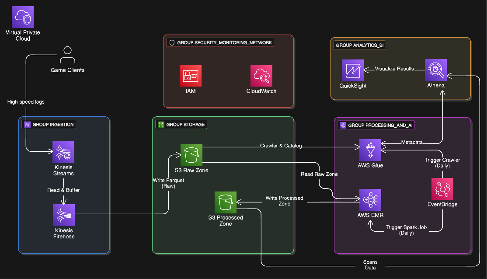

# AWS Gaming Analytics Architecture

## Project Overview

Designed an enterprise-scale gaming analytics platform capable of ingesting, processing, storing and analyzing high-volume gaming telemetry using AWS cloud services.

The architecture focuses on scalability, security, cost optimization and real-time analytics for cloud gaming environments.

---

## Business Problem

Gaming platforms generate massive volumes of gameplay events, system logs and user interaction data.

The challenge is to:

* Ingest data in real time
* Process large event streams efficiently
* Store data cost-effectively
* Perform analytics with low latency
* Maintain security and operational visibility

---

## Architecture Diagram

---

## AWS Services Used

### Data Ingestion

* Amazon Kinesis Data Streams
* Amazon Kinesis Firehose

### Storage

* Amazon S3
* AWS Glue Data Catalog

### Processing

* Amazon EMR (Apache Spark)
* AWS Glue

### Analytics

* Amazon Athena
* Amazon QuickSight

### Security

* AWS IAM
* Amazon VPC

### Monitoring

* Amazon CloudWatch

---

## Data Flow

Game Clients
↓
Amazon Kinesis Data Streams
↓
Amazon Kinesis Firehose
↓
Amazon S3 Raw Zone
↓
AWS Glue Catalog
↓
Amazon EMR (Spark Processing)
↓
Amazon S3 Processed Zone
↓
Amazon Athena
↓
Amazon QuickSight

---

## Capacity Planning

* Daily ingestion volume: approximately 40 GB/day
* Event throughput: 500–2500 events/sec
* Storage capacity: approximately 35 TB
* Real-time ingestion using Kinesis
* Batch processing using Spark on EMR

---

## Security Architecture

* IAM role-based access control
* VPC network isolation
* Private subnet deployment
* Controlled access to storage resources
* CloudWatch monitoring and alerting

---

## Business Impact

* Improved analytics capabilities
* Increased scalability
* Reduced operational bottlenecks
* Better visibility into player behavior
* Enhanced decision-making through data-driven insights

---

## Project Documentation

The complete architecture report is available in:

Tanmay_Kumar_Mishra_AWS_Project.pdf
